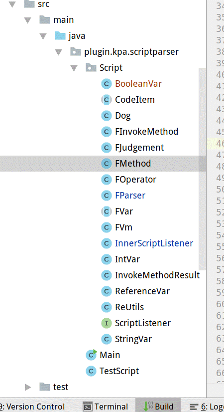

**旧版使用的脚本引擎，已丢弃**

2018-5-30

1.修复对比null时的对比错误的bug，对比不了

FScriptParser

 

简单脚本解析执行

 

一、介绍

一个简单的脚本解析，采用正则表达式解析代码，逐行分解，遇到函数时再交由内置的函数监听和用户自定义的函数监听执行，支持if,for赋值，函数定义，总体来说比较鸡肋

二、代码结构



FParser类为解析的主类

 

```
FParser parser = new FParser();
```

直接构造,,不写了，直接看Test.java那个测试类

三、语法

四、函数监听扩展